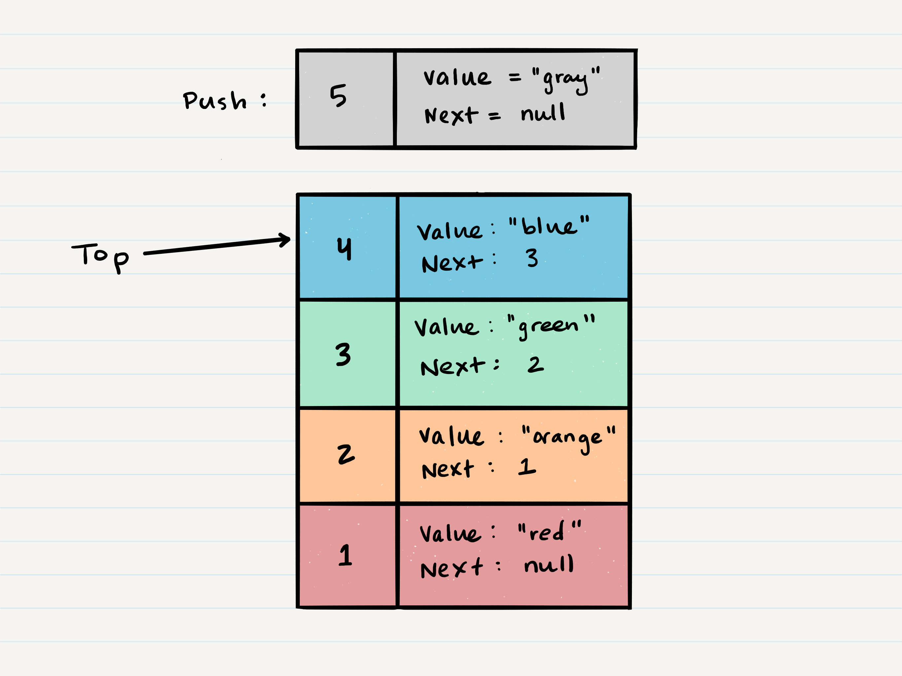

# Stacks and Queues
### What is a Stack
- Stack - Common terminology

   - Push - Nodes or items that are put into the stack are pushed.
   - Pop - Nodes or items that are removed from the stack are popped. When you attempt to pop an 3. 3. empty stack an exception will be raised.
   - Top - This is the top of the stack.
   - Peek - When you peek you will view the value of the top Node in the stack. When you attempt to 6. peek an empty stack an exception will be raised.
   - IsEmpty - returns true when stack is empty otherwise returns false.

### Stacks follow - Concepts

   - FILO First In Last Out This means that the first item added in the stack will be the last item popped out of the stack.

   - LIFO Last In First Out This means that the last item added to the stack will be the first item popped out of the stack.  


### Push O(1)

- Pushing a Node onto a stack will always be an O(1) operation  



    ```
    ALOGORITHM push(value)
    // INPUT <-- value to add, wrapped in Node internally
    // OUTPUT <-- none
    node = new Node(value)
    node.next <-- Top
    top <-- Node
    ```
### Pop O(1)

- Popping a Node off a stack is the action of removing a Node from the top.  

   ```
       ALGORITHM pop()
    // INPUT <-- No input
    // OUTPUT <-- value of top Node in stack
    // EXCEPTION if stack is empty

    Node temp <-- top
    top <-- top.next
    temp.next <-- null
    return temp.value
    ```
### Peek O(1)

- When conducting a peek, you will only be inspecting the top Node of the stack.  

    ```
        ALGORITHM peek()
    // INPUT <-- none
    // OUTPUT <-- value of top Node in stack
    // EXCEPTION if stack is empty

    return top.value
    ```
### IsEmpty O(1)

     ```
          ALGORITHM isEmpty()
    // INPUT <-- none
    // OUTPUT <-- boolean

    return top = NULL
    ```
### Queues follow these concepts:

- FIFO First In First Out: This means that the first item in the queue will be the first item out of the queue.

- LILO Last In Last Out: This means that the last item in the queue will be the last item out of the queue.  

### Enqueue O(1)

- When you add an item to a queue, you use the enqueue action  

    ```
        ALGORITHM enqueue(value)
    // INPUT <-- value to add to queue (will be wrapped in Node internally)
    // OUTPUT <-- none
    node = new Node(value)
    rear.next <-- node
    rear <-- node
    ```
### Dequeue O(1)

- When you remove an item from a queue, you use the dequeue action  

   ```
       ALGORITHM dequeue()
    // INPUT <-- none
    // OUTPUT <-- value of the removed Node
    // EXCEPTION if queue is empty

    Node temp <-- front
    front <-- front.next
    temp.next <-- null

    return temp.value
    ```
### Peek O(1)

- inspecting the front Node of the queue. 
 
   ```
      ALGORITHM peek()
   // INPUT <-- none
   // OUTPUT <-- value of the front Node in Queue
   // EXCEPTION if Queue is empty

   return front.value
   ```
### IsEmpty O(1)

    ```
       ALGORITHM isEmpty()
    // INPUT <-- none
    // OUTPUT <-- boolean

    return front = NULL
    ```

- References: [Stacks & Queues](https://codefellows.github.io/common_curriculum/data_structures_and_algorithms/Code_401/class-10/resources/stacks_and_queues.html)
