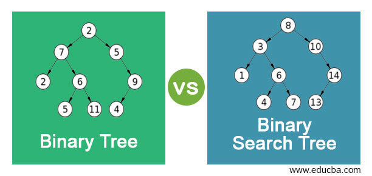

# Read: Trees  
## Trees  
- A tree is a hierarchical data structure defined as a collection of nodes, Nodes represent value and nodes are connected by edges.  
### Trees Terminology  
- Node: its a component which contain a value, and references to other nodes.  
- Root: the node at the beginning of the tree.  
- K: number that specifies the maximum number of children any node may have in a k-ary tree. In a binary trees its always 2.  
- Left: reference to one child node, in a binary tree.  
- Right: reference to the other child node, in a binary tree.  
- Edge: the link between a parent and child node.  
- Leaf: a node that does not have any children.  
- Height: The height of a tree is the number of edges from the root to the furthest leaf.  
   

### Traversals  
- Traversing a tree allows us to search for a node, print out the contents of a tree.  
- **categories of traversals in trees:**  
   - Depth First: its when we prioritize going through the depth (height) of the tree first, it has three methods:  
      - Pre-order: root >> left >> right
      - In-order: left >> root >> right
      - Post-order: left >> right >> root

   - Breadth First: iterates through the tree by going through each level of the tree node-by-node.  
      
       
     
     - K-ary Trees When the Nodes can have more than 2 child nodes, it called a K-ary Tree, K is refering to the maximum number of children that each Node is able to have.  
### Traversing  
- traversing a K-ary tree requires a similar approach to the breadth first traversal.  
### adding nodes:  
- There are no structural rules for where nodes are “supposed to go” in a binary tree,so it doesn’t matter where a new node gets placed.  
- we use breadth first traversal. During the traversal, we find the first node that does not have all it’s children filled, and insert the new node as a child. We fill the child slots from left to right.  
    - A “perfect” binary tree is one where every non-leaf node has exactly two children. The maximum width for a perfect binary tree, is 2^(h-1), where h is the height of the tree. Height can be calculated as log n, where n is the number of nodes.  
          
 

