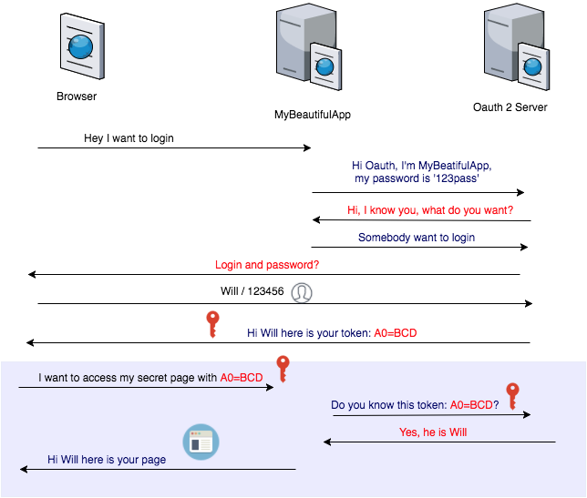

# Spring Authorization
## Spring Boot and OAuth2
#### create a minimal application that uses GitHub for authentication steps.  
- creating new project: create a Spring Boot application, by go to https://start.spring.io and generate an empty project (choosing the "Web" dependency as a starting point).
- Add a Home Page: In the new project, create index.html in the src/main/resources/static folder.
- Securing the Application with GitHub and Spring Security by adding Spring Security as a dependency, then include the Spring Security OAuth 2.0 Client starter.
- Add a New GitHub App: To use GitHub’s OAuth 2.0 authentication system for login, Add a new GitHub app. Select "New OAuth App" then the "Register a new OAuth application" page is presented. Enter an app name and description. Then, enter your app’s home page, which should be http://localhost:8080, in this case. Finally, indicate the Authorization callback URL as http://localhost:8080/login/oauth2/code/github and click Register Application.
- Add a Welcome Page:  
    - Conditional Content on the Home Page: To render content on the condition that the user is authenticated, you have the option of either server-side or client-side rendering.
    - Making the Home Page Public: There’s one final change you’ll need to make. This app will now work fine and authenticate as before, but it’s still going to redirect before showing the page. To make the link visible, we also need to switch off the security on the home page by extending WebSecurityConfigurerAdapter.
- Add a Logout Button:
    - Client Side Changes: in the "authenticated" section of the UI, we add the button, and then we provide the logout() function that it refers to in the JavaScript.
    - Adding a Logout Endpoint.  
- Configure application.yml : to make the link to GitHub, add the following to your application.yml    
   ```
   spring:
     security:
       oauth2:
         client:
           registration:
             github:
               clientId: github-client-id
               clientSecret: github-client-secret
               ```  
             
- Boot Up the Application : you can run your app again and visit the home page at http://localhost:8080. Now, instead of the home page, you should be redirected to login with GitHub.    


