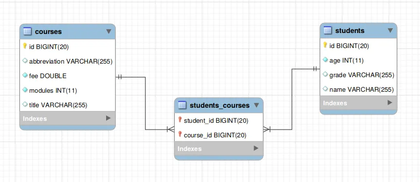

# Web App Security
## Many To Many Relationship  
- many-to-many relationship : bidirectional relationship 
- Many-to-many relationships are one of the most commonly used association mappings. They require an additional database table to hold the primary keys of both relationship tables.  
### how to implement a many-to-many relationship mapping using Spring Data JPA and MySQL:  
#### Dependencies  
- To use Spring Data JPA with the MySQL database in Spring Boot, you need both spring-data-starter-data-jpa and mysql-connector-java dependencies to the Gradle project's build.gradle file:  

   ```
   implementation 'org.springframework.boot:spring-boot-starter-data-jpa'
   runtimeOnly 'mysql:mysql-connector-java'
   ```  
- If you are starting a new project, just use [Spring Initializr](https://start.spring.io/) web tool to bootstrap a new Spring Boot application with the above-mentioned dependencies.  
#### Configure MySQL Database  
- Spring Boot will automatically configure a DataSource bean based on the properties in the **application.properties** file.  

#### Many-To-Many Relationship  
- A many-to-many relationship refers to the relationship between two entities/tables A and B in which one element/row of A may only be associated with many elements/rows of B and vice versa.
- A typical example of such a many-to-many relationship is the relationship between students and courses. A student can enroll in multiple courses and a course can also have multiple students, thus forming a many-to-many relationship.
- To model the above relationship in the database, you need to create three tables, one each for both students and courses, and another one for holding relationship keys, as shown below in the Entity-Relationship (ER) diagram:  
 
     
   
- students_courses is a join table that contains two foreign keys, student_id and course_id, to reference both students and courses database tables. Both these foreign keys also act as a composite primary key for the students_courses table.  

#### Create Entities  
- We need to create two entity classes, Student and Course, to map the above many-to-many relationship. You don't need to create a separate entity class for the join table.  
   ```
   Student.java

   package com.attacomsian.jpa.many2many.domains;

   import javax.persistence.*;
   import java.io.Serializable;
   import java.util.Set;

   @Entity
   @Table(name = "students")
   public class Student implements Serializable {

       @Id
       @GeneratedValue(strategy = GenerationType.IDENTITY)
       private Long id;

       private String name;
       private int age;
       private String grade;

       @ManyToMany(fetch = FetchType.LAZY, cascade = CascadeType.PERSIST)
       @JoinTable(name = "students_courses",
               joinColumns = {
                       @JoinColumn(name = "student_id", referencedColumnName = "id",
                               nullable = false, updatable = false)},
               inverseJoinColumns = {
                       @JoinColumn(name = "course_id", referencedColumnName = "id",
                               nullable = false, updatable = false)})
       private Set<Course> courses = new HashSet<>();

       public Student() {
       }

       public Student(String name, int age, String grade) {
           this.name = name;
           this.age = age;
           this.grade = grade;
       }

       // getters and setters, equals(), toString() .... (omitted for brevity)
   }
   ```
   
   ```
   Course.java

   package com.attacomsian.jpa.many2many.domains;

   import javax.persistence.*;
   import java.io.Serializable;
   import java.util.Set;

   @Entity
   @Table(name = "courses")
   public class Course implements Serializable {

       @Id
       @GeneratedValue(strategy = GenerationType.IDENTITY)
       private Long id;

       private String title;
       private String abbreviation;
       private int modules;
       private double fee;

       @ManyToMany(mappedBy = "courses", fetch = FetchType.LAZY)
       private Set<Student> students = new HashSet<>();

       public Course() {
       }

       public Course(String title, String abbreviation, int modules, double fee) {
           this.title = title;
           this.abbreviation = abbreviation;
           this.modules = modules;
           this.fee = fee;
       }

       // getters and setters, equals(), toString() .... (omitted for brevity)
   }
   ```
   
- Both Student and Course classes are annotated with the Entity annotation to indicate that they are JPA entities.  
- The @Table annotation is used to specify the name of the database table that should be mapped to this entity.  
- The id attributes are annotated with both @Id and @GeneratedValue annotations. The former annotation indicates that they are the primary keys of the entities. The latter annotation defines the primary key generation strategy. In the above case, we have declared that the primary key should be an AUTO INCREMENT field.   
#### @ManyToMany Annotation  
- A many-to-many relationship between two entities is defined by using the @ManyToMany annotation in Spring Data JPA. It uses the mappedBy attribute to indicate the entity that owns the bidirectional relationship. In a bidirectional relationship, the @ManyToMany annotation is defined in both entities but only one entity can own the relationship. We've picked the Student class as an owner of the relationship in the above example.  
#### @JoinTable Annotation  
- The @JoinTable annotation defines the join table between two entities on the owner's side of the relationship. We have used this annotation to define the students_courses table. If the @JoinTable annotation is left out, the default values of the annotation elements apply. The name of the join table is supposed to be the table names of the associated primary tables concatenated together (owning side first) using an underscore.  
#### Create Repositories  
- The next step is to define the repository interfaces for storing and accessing the data from the database. We'll extend our repositories from Spring Data JPA's CrudRepository interface that provides methods for generic CRUD operations.  
   ```
   StudentRepository.java

   package com.attacomsian.jpa.many2many.repositories;

   import com.attacomsian.jpa.many2many.domains.Student;
   import org.springframework.data.repository.CrudRepository;

   import java.util.List;

   public interface StudentRepository extends CrudRepository<Student, Long> {

       List<Student> findByNameContaining(String name);
   }
   ```
   
   ```
   CourseRepository.java

   package com.attacomsian.jpa.many2many.repositories;

   import com.attacomsian.jpa.many2many.domains.Course;
   import org.springframework.data.repository.CrudRepository;

   import java.util.List;

   public interface CourseRepository extends CrudRepository<Course, Long> {

       List<Course> findByTitleContaining(String title);

       List<Course> findByFeeLessThan(double fee);
   }
   ```
- We also defined a few derived query methods like findByFeeLessThan() to retrieve all courses that have a fee less than the given value and more.   
- That's it. You are done with defining a many-to-many relationship mapping in Spring Data JPA.   
#### Create an Application Class  
- Now is the time to create the main application class for our Spring Boot console application to test our many-to-many relationship mapping:  

   ```
   Application.java

   package com.attacomsian.jpa;

   import com.attacomsian.jpa.many2many.domains.Course;
   import com.attacomsian.jpa.many2many.domains.Student;
   import com.attacomsian.jpa.many2many.repositories.CourseRepository;
   import com.attacomsian.jpa.many2many.repositories.StudentRepository;
   import org.springframework.boot.CommandLineRunner;
   import org.springframework.boot.SpringApplication;
   import org.springframework.boot.autoconfigure.SpringBootApplication;
   import org.springframework.context.annotation.Bean;

   import java.util.Arrays;

   @SpringBootApplication
   public class Application {

       public static void main(String[] args) {
           SpringApplication.run(Application.class, args);
       }

       @Bean
       public CommandLineRunner mappingDemo(StudentRepository studentRepository,
                                            CourseRepository courseRepository) {
           return args -> {

               // create a student
               Student student = new Student("John Doe", 15, "8th");

               // save the student
               studentRepository.save(student);

               // create three courses
               Course course1 = new Course("Machine Learning", "ML", 12, 1500);
               Course course2 = new Course("Database Systems", "DS", 8, 800);
               Course course3 = new Course("Web Basics", "WB", 10, 0);

               // save courses
               courseRepository.saveAll(Arrays.asList(course1, course2, course3));

               // add courses to the student
               student.getCourses().addAll(Arrays.asList(course1, course2, course3));

               // update the student
               studentRepository.save(student);
           };
       }
   }
   ```
   
#### Run the Application  
- Next, run the application to see the output. If you are using Gradle, execute the following command to start the application:  
   ```
   $ ./gradlew bootRun
   ```  
   
- Once the application is started, you should see the following lines printed on the console:  
   ```
   Hibernate: drop table if exists courses
   Hibernate: drop table if exists students
   Hibernate: drop table if exists students_courses
   Hibernate: create table courses (id bigint not null auto_increment, abbreviation varchar(255), fee double precision not null, modules integer not null, title varchar(255), primary key (id)) engine=InnoDB
   Hibernate: create table students (id bigint not null auto_increment, age integer not null, grade varchar(255), name varchar(255), primary key (id)) engine=InnoDB
   Hibernate: create table students_courses (student_id bigint not null, course_id bigint not null, primary key (student_id, course_id)) engine=InnoDB
   Hibernate: insert into students (age, grade, name) values (?, ?, ?)
   Hibernate: insert into courses (abbreviation, fee, modules, title) values (?, ?, ?, ?)
   Hibernate: insert into courses (abbreviation, fee, modules, title) values (?, ?, ?, ?)
   Hibernate: insert into courses (abbreviation, fee, modules, title) values (?, ?, ?, ?)
   Hibernate: select student0_.id as id1_4_0_, student0_.age as age2_4_0_, student0_.grade as grade3_4_0_, student0_.name as name4_4_0_ from students student0_ where student0_.id=?
   Hibernate: select courses0_.student_id as student_1_5_0_, courses0_.course_id as course_i2_5_0_, course1_.id as id1_2_1_, course1_.abbreviation as abbrevia2_2_1_, course1_.fee as fee3_2_1_, course1_.modules as modules4_2_1_, course1_.title as title5_2_1_ from students_courses courses0_ inner join courses course1_ on courses0_.course_id=course1_.id where courses0_.student_id=?
   Hibernate: select course0_.id as id1_2_0_, course0_.abbreviation as abbrevia2_2_0_, course0_.fee as fee3_2_0_, course0_.modules as modules4_2_0_, course0_.title as title5_2_0_ from courses course0_ where course0_.id=?
   Hibernate: select course0_.id as id1_2_0_, course0_.abbreviation as abbrevia2_2_0_, course0_.fee as fee3_2_0_, course0_.modules as modules4_2_0_, course0_.title as title5_2_0_ from courses course0_ where course0_.id=?
   Hibernate: select course0_.id as id1_2_0_, course0_.abbreviation as abbrevia2_2_0_, course0_.fee as fee3_2_0_, course0_.modules as modules4_2_0_, course0_.title as title5_2_0_ from courses course0_ where course0_.id=?
   Hibernate: insert into students_courses (student_id, course_id) values (?, ?)
   Hibernate: insert into students_courses (student_id, course_id) values (?, ?)
   Hibernate: insert into students_courses (student_id, course_id) values (?, ?)
   ...
   ```  
   


