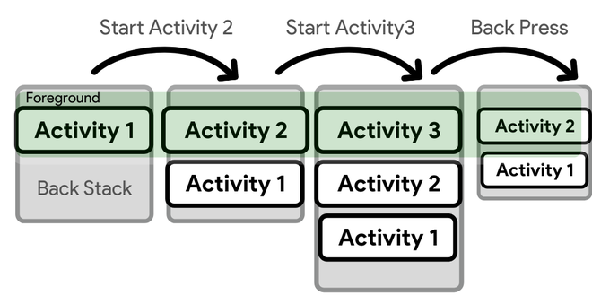
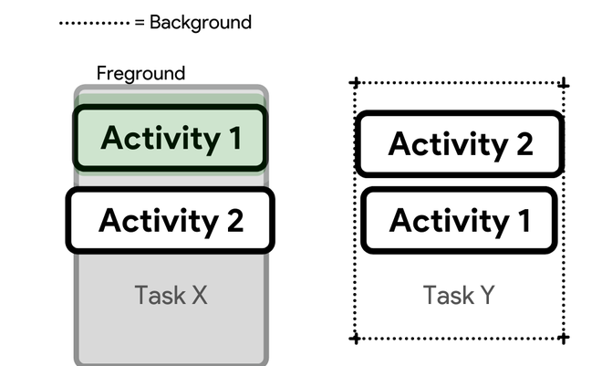

# class 27
## Task and Back Stack
- A task is a collection of activities that users interact with when trying to do something in your app. These activities are arranged in a stack—the back stack—in the order in which each activity is opened.  
- When the current activity switches to a new one, the new activity is pushed to the top of the stack and takes control of the attention.  
- The preceding action is still there in the stack, but it is no longer active.  
- When a task is completed, the system saves the current state of the user interface.  
- The current activity is destroyed when the user hits the Back button, and the prior activity restarts (the previous state of its UI is restored).  
-  The activities in the stack are only pushed onto and popped off the stack—pushed into the stack when the current activity starts it and popped off when the user exits it using the Back button. 
 
   
 
 - If the user presses Back repeatedly, each activity in the stack is popped off to show the one before it, until the user returns to the Home screen, The task is no longer active after all actions have been removed from the stack.  
 --------  
 
 - A task is a logical unit that may be sent to the “background” when users start a new task or press the Home button to return to the Home screen.
 - All operations in the task are paused while it is in the background, but the task’s back stack remains intact, the task has just lost focus while another task is being performed.
 - A task can then be brought back into the “foreground,” allowing users to resume their work where they left off.  
 - there is an example to explain this:
   -  Assume that the current task (Task A) contains three activities in its stack, two of which are underneath the current activity. The user hits the Home button, then opens the app launcher and selects a new app. Task A is pushed to the background when the Home screen appears. When a new app is launched, the system creates a task (Task B) for it, which has its own set of activities. After interacting with that app, the user goes back to Home and picks the app that launched Task A in the first place. Task A now appears in the forefront, with all three activities in its stack intact and the activity at the top of the stack resumed. The user may now return to Task B by navigating to Home and choosing the app icon that initiated the task (or choosing the app’s task from the Recents page).  
 
 
 
 ----------
 
 ## Android SharedPreferences  
 - Shared Preferences is the way in which one can store and retrieve small amounts of primitive data as key/value pairs.
 - For example, you might have a key being “username” and for the value, you might store the user’s username. And then you could retrieve that by its key (here username).   
 - Shared Preferences are suitable in different situations. For example, when the user’s settings need to be saved or to store data that can be used in different activities within the app.  
 - onPause() will always be called before your activity is placed in the background or destroyed, So for the data to be saved persistently, it’s preferred to save it in onPause(), which could be restored in onCreate() of the activity.  
 - The data stored using shared preferences are kept private within the scope of the application.  
 - Here is an Example of how we can store the data in the shared preference in the onpause() When the user closes the application to save the data, and get the data again in the onResume() Because this is what will be called when the app opens again.  
 
 
    ```
    import androidx.appcompat.app.AppCompatActivity;

    import android.content.SharedPreferences;
    import android.os.Bundle;
    import android.widget.EditText;

    public class MainActivity extends AppCompatActivity {

	    private EditText name, age;

	    @Override
	    protected void onCreate(Bundle savedInstanceState) {
		    super.onCreate(savedInstanceState);
		    setContentView(R.layout.activity_main);
		    name = findViewById(R.id.edit1);
		    age = findViewById(R.id.edit2);
	    }

	    // Fetch the stored data in onResume()
	    // Because this is what will be called
	    // when the app opens again
	    @Override
	    protected void onResume() {
		    super.onResume();

		    // Fetching the stored data
		    // from the SharedPreference
		    SharedPreferences sh = getSharedPreferences("MySharedPref", MODE_PRIVATE);

		    String s1 = sh.getString("name", "");
		    int a = sh.getInt("age", 0);

		    // Setting the fetched data
		    // in the EditTexts
		    name.setText(s1);
		    age.setText(String.valueOf(a));
	    }

	    // Store the data in the SharedPreference
	    // in the onPause() method
	    // When the user closes the application
	    // onPause() will be called
	    // and data will be stored
	    @Override
	    protected void onPause() {
		    super.onPause();

		    // Creating a shared pref object
		    // with a file name "MySharedPref"
		    // in private mode
		    SharedPreferences sharedPreferences = getSharedPreferences("MySharedPref", MODE_PRIVATE);
		    SharedPreferences.Editor myEdit = sharedPreferences.edit();

		    // write all the data entered by the user in SharedPreference and apply
		    myEdit.putString("name", name.getText().toString());
		    myEdit.putInt("age", Integer.parseInt(age.getText().toString()));
		    myEdit.apply();
	    }
    }
    ```

