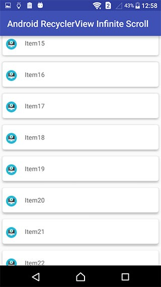

# RecyclerView in android
- RecyclerView is a ViewGroup added to the android studio as a successor of the GridView and ListView.   
- It is a container used for displaying large amount of data sets that can be scrolled very efficiently by maintaining a limited number of views.  
- To implement a basic RecyclerView three sub-parts are needed to be constructed which offer the users the degree of control they require in making varying designs of their choice.  
   - The Card Layout: The card layout is an XML layout which will be treated as an item for the list created by the RecyclerView.    
   - The ViewHolder: The ViewHolder is a java class that stores the reference to the card layout views that have to be dynamically modified during the execution of the program by a list of data obtained either by online databases or added in some other way.  
   - The Data Class: The Data class is a custom java class that acts as a structure for holding the information for every item of the RecyclerView.  

  

- To implement a recyclerview to our application we need apply these steps with an example codes:  
   - add dependencies to gradle  
   
      ```
      implementation 'com.android.support:appcompat-v7:28.0.0'
      implementation 'com.android.support:recyclerview-v7:28.0.0'
      ```
   - Add the xml layout files for the activity and for the RecyclerView row  
      - activity layout  
      
         ```
         <?xml version="1.0" encoding="utf-8"?>
         <RelativeLayout
             xmlns:android="http://schemas.android.com/apk/res/android"
             android:layout_width="match_parent"
             android:layout_height="match_parent">

             <android.support.v7.widget.RecyclerView
                 android:id="@+id/rvAnimals"
                 android:layout_width="match_parent"
                 android:layout_height="match_parent"/>

        </RelativeLayout>
        ```   
     - row layout  
     
        ```
        <?xml version="1.0" encoding="utf-8"?>
        <LinearLayout
            xmlns:android="http://schemas.android.com/apk/res/android"
            android:layout_width="match_parent"
            android:layout_height="wrap_content"
            android:orientation="horizontal"
            android:padding="10dp">

            <TextView
                android:id="@+id/tvAnimalName"
                android:layout_width="wrap_content"
                android:layout_height="wrap_content"
                android:textSize="20sp"/>

        </LinearLayout>
        ```
   - Make the RecyclerView adapter: The RecyclerView needs an adapter to populate the views in each row with your data.   
   
      ```
      public class MyRecyclerViewAdapter extends RecyclerView.Adapter<MyRecyclerViewAdapter.ViewHolder> {

          private List<String> mData;
          private LayoutInflater mInflater;
          private ItemClickListener mClickListener;

          // data is passed into the constructor
          MyRecyclerViewAdapter(Context context, List<String> data) {
              this.mInflater = LayoutInflater.from(context);
              this.mData = data;
          }

          // inflates the row layout from xml when needed
          @Override
          public ViewHolder onCreateViewHolder(ViewGroup parent, int viewType) {
              View view = mInflater.inflate(R.layout.recyclerview_row, parent, false);
              return new ViewHolder(view);
          }

          // binds the data to the TextView in each row
          @Override
          public void onBindViewHolder(ViewHolder holder, int position) {
              String animal = mData.get(position);
              holder.myTextView.setText(animal);
          }

          // total number of rows
          @Override
          public int getItemCount() {
               return mData.size();
          }


          // stores and recycles views as they are scrolled off screen
          public class ViewHolder extends RecyclerView.ViewHolder implements View.OnClickListener {
              TextView myTextView;

              ViewHolder(View itemView) {
                   super(itemView);
                  myTextView = itemView.findViewById(R.id.tvAnimalName);
                  itemView.setOnClickListener(this);
              }

              @Override
              public void onClick(View view) {
                  if (mClickListener != null) mClickListener.onItemClick(view, getAdapterPosition());
              }
          }

          // convenience method for getting data at click position
          String getItem(int id) {
              return mData.get(id);
          }

          // allows clicks events to be caught
          void setClickListener(ItemClickListener itemClickListener) {
              this.mClickListener = itemClickListener;
          }

          // parent activity will implement this method to respond to click events
          public interface ItemClickListener {
              void onItemClick(View view, int position);
          }
      }
      ```   
   - Initialize the RecyclerView in your activity   
   
      ```
      public class MainActivity extends AppCompatActivity implements MyRecyclerViewAdapter.ItemClickListener {

          MyRecyclerViewAdapter adapter;

          @Override
          protected void onCreate(Bundle savedInstanceState) {
              super.onCreate(savedInstanceState);
              setContentView(R.layout.activity_main);

              // data to populate the RecyclerView with
              ArrayList<String> animalNames = new ArrayList<>();
              animalNames.add("Horse");
              animalNames.add("Cow");
              animalNames.add("Camel");
              animalNames.add("Sheep");
              animalNames.add("Goat");

              // set up the RecyclerView
              RecyclerView recyclerView = findViewById(R.id.rvAnimals);
              recyclerView.setLayoutManager(new LinearLayoutManager(this));
              adapter = new MyRecyclerViewAdapter(this, animalNames);
              adapter.setClickListener(this);
              recyclerView.setAdapter(adapter);
          }

          @Override
          public void onItemClick(View view, int position) {
              Toast.makeText(this, "You clicked " + adapter.getItem(position) + " on row number " + position, Toast.LENGTH_SHORT).show();
          }
      }
      ```
      
## Resources  
- [recyclerview-example](https://stackoverflow.com/questions/40584424/simple-android-recyclerview-example)
- [recyclerview](https://www.geeksforgeeks.org/android-recyclerview/)

