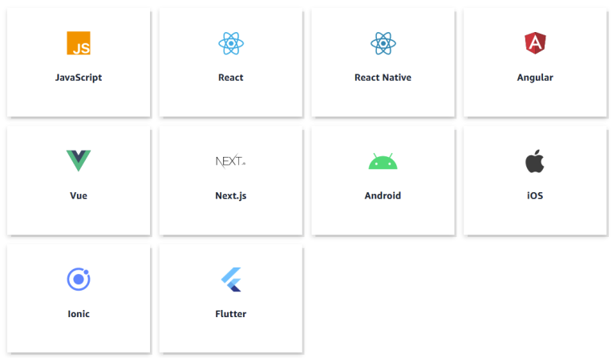

# AWS Amplify  
- AWS Amplify is a set of purpose-built tools and features that lets frontend web and mobile developers quickly and easily build full-stack applications on AWS, with the flexibility to leverage the breadth of AWS services as your use cases evolve.  
- With Amplify, you can configure a web or mobile app backend, connect your app in minutes, visually build a web frontend UI, and easily manage app content outside the AWS console. 
- With amplify you can enable the data storage authentication file storage host your app or even add AI or ML to your front end web or mobile application.

  

- AWS Amplify includes a wide variety of open-source libraries and drag-and-drop UI components developers can use as building blocks for their apps. It also has a built-in CLI you can use to build your backend. And for an additional fee, AWS Amplify Console provides web hosting services for your app.  
- AWS Amplify has components for:  
   - Data storage   
      - Keep your app data synced with the cloud, manage your distributed data, and handle subscriptions and messaging.  
   - Analytics  
      - Track user sessions and report on their behavior. Set up custom attributes and analyze conversion funnels.  
   - Push notifications   
      - Easily manage your campaigns and send messages to your users across multiple channels, including text, email, and push.  
   - Authentication  
      - Access ready-to-use workflows for MFA, single sign-on, forgot password, etc.  

- The framework supports iOS, Android, Web, and React Native mobile apps, and React, Ionic, Angular, and vue.js for web apps.  

  

