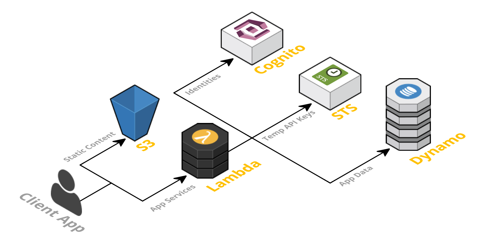

# Serverless and Amplify

- Serverless is a cloud computing execution model where the cloud provider dynamically manages the allocation and provisioning of servers.  
- Serverless applications are event-driven cloud-based systems where application development rely solely on a combination of third-party services, client-side logic and cloud-hosted remote procedure calls (Functions as a Service).  
- some of the currently available cloud services:  
   - AWS Lambda
   - Google Cloud Functions
   - Azure Functions
   - IBM OpenWhisk
   - Alibaba Function Compute
   - Iron Functions
   - Auth0 Webtask
   - Oracle Fn Project
   - Kubeless

     
     
  
## Functions as a Service (FaaS)  
- FaaS is an implementation of Serverless architectures where engineers can deploy an individual function or a piece of business logic.  
- Principles of FaaS:  
   - Complete management of servers  
   - Invocation based billing  
   - Event-driven and instantaneously scalable  

- Key properties of FaaS:  
   - Independent, server-side, logical functions : FaaS are similar to the functions you’re used to writing in programming languages, small, separate, units of logic that take input arguments, operate on the input and return the result.  
   - Stateless : With Serverless, everything is stateless, you can’t save a file to disk on one execution of your function and expect it to be there at the next. Any two invocations of the same function could run on completely different containers under the hood.  
   - Ephemeral : FaaS are designed to spin up quickly, do their work and then shut down again. They do not linger unused. As long as the task is performed the underlying containers are scrapped.
   - Event-triggered : Although functions can be invoked directly, yet they are usually triggered by events from other cloud services such as HTTP requests, new database entries or inbound message notifications. FaaS are often used and thought of as the glue between services in a cloud environment.  
   - Scalable by default : With stateless functions multiple containers can be initialised, allowing as many functions to be run (in parallel, if necessary) as needed to continually service all incoming requests.  
   - Fully managed by a Cloud vendor : AWS Lambda, Azure Functions, IBM OpenWhisk and Google Cloud Functions are most well-known FaaS solutions available. Each offering typically supports a range of languages and runtimes e.g. Node.js, Python, .NET Core, Java.  

## The Serverless App  
- A Serverless solution consists of a web server (Amazon S3), Lambda functions (FaaS), security token service (STS), user authentication ( AWS Cognito is an identity service which is integrated with AWS Lambda) and database (AWS DynamoDB provides a fully managed NoSQL database).  
- Client Application — > The UI of your application is rendered client side in Modern Frontend Javascript App which allows us to use a simple, static web server.  
   - Security Token Service (STS) — generates temporary AWS credentials (API key and secret key) for users of the application. These temporary credentials are used by the client application to invoke the AWS API (and thus invoke Lambda).  

   
