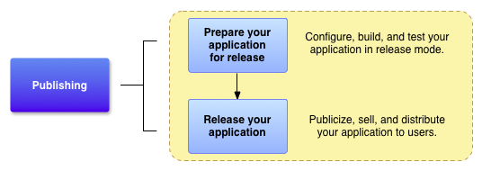
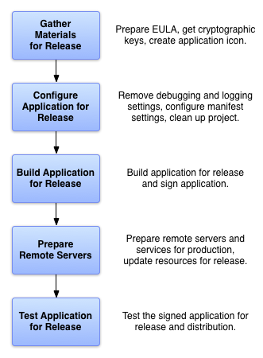

# Monetization  
## Publish your app  
- Publishing is the general process that makes your Android applications available to users.  
- There are two main steps to publish our apps and make it available to the users:

   
   
   - **Preparing our app for release**: build a release version of our application, which users can download and install on their Android-powered devices.  
      - **Configuring our application for release.** for example ( remove **Log** calls, remove the **android:debuggable** attribute from our manifest file, provide values for the **android:versionCode** and **android:versionName** attributes, which are located in the **\<manifest\>** element )  
      - **Building and signing a release version of our application.**  ( we can use the Gradle build files with the release build type to build and sign a release version of our application )  
      - **Testing the release version of our application.**  ( we should thoroughly test the release version on at least one target handset device and one target tablet device )  
      - **Updating application resources for release.**   
      - **Preparing remote servers and services that our application depends on.**
      - **get a private key for signing your application.**  
      - **create an icon for our application.**  
      - **prepare an End User License Agreement (EULA) to protect our person, organization, and intellectual property.**   
      
         
       
   - **Releasing our app to users**: Usually, we release applications through an application marketplace such as Google Play, but we can also release applications on our own website or by sending an application directly to a user.   

## Resources
- [Publish your app](https://developer.android.com/studio/publish)
- [For publish in Google play](https://play.google.com/console/about/guides/releasewithconfidence/)
