# Graphs  
- Graph is a non-linear data structure consisting of nodes and edges.  
- The nodes are also called a vertices, and the edges are lines or arcs that connect any two nodes in the graph.  
- A Graph consists of a finite set of vertices(or nodes) and set of Edges which connect a pair of nodes.  
## Types of Graphs in Data Structures  
### 1- Directed Graph  
- directed graph also referred to as a digraph, is a set of nodes connected by edges, each with a direction.  

### 2- Undirected Graph  
- undirected graph is a set of nodes and links connecting them.  
- The order of the two connected vertices is irrelevant and has no direction.  

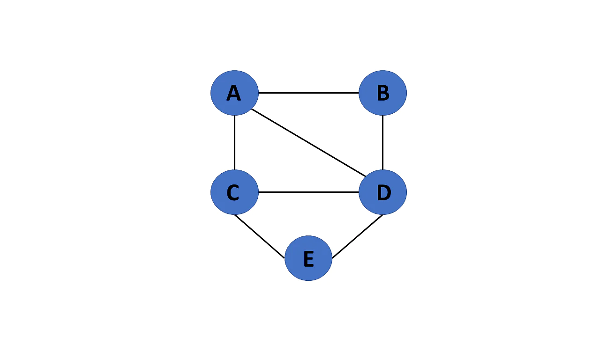

### 3- Connected Graph
- If there is a path between one vertex of a graph data structure and any other vertex, the graph is connected.  

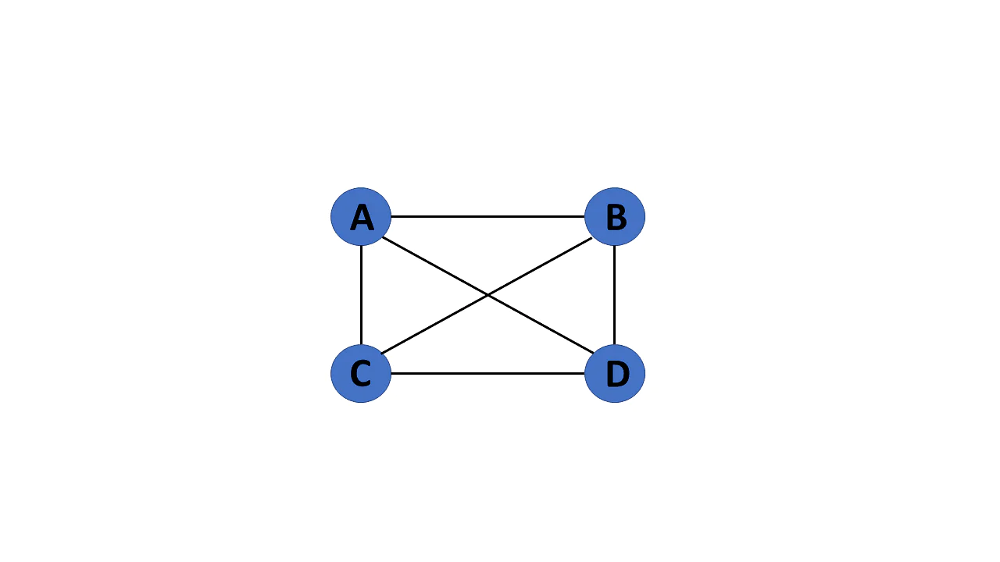

### 4- Disconnected Graph
- When there is no edge linking the vertices, you refer to the null graph as a disconnected graph.  

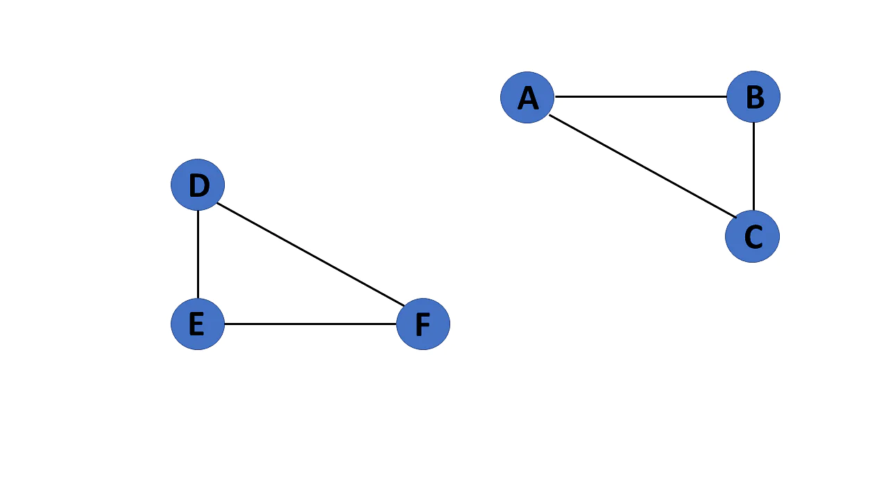  

### 5- Complete Graph  
- Using the edges, with n number of vertices must be connected.  
- It's also known as a full graph because each vertex's degree must be n-1. 

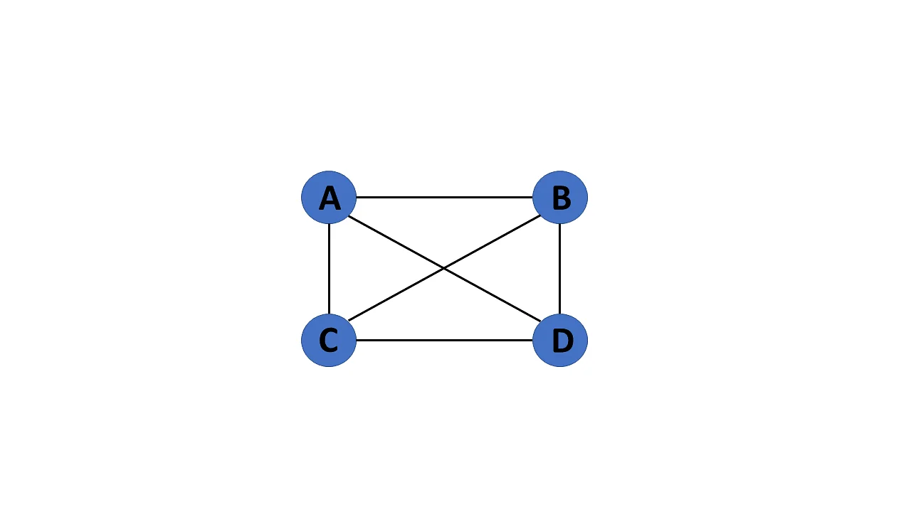   

### 6- Cyclic Graph  
- If a graph contains at least one graph cycle, it is considered to be cyclic.  

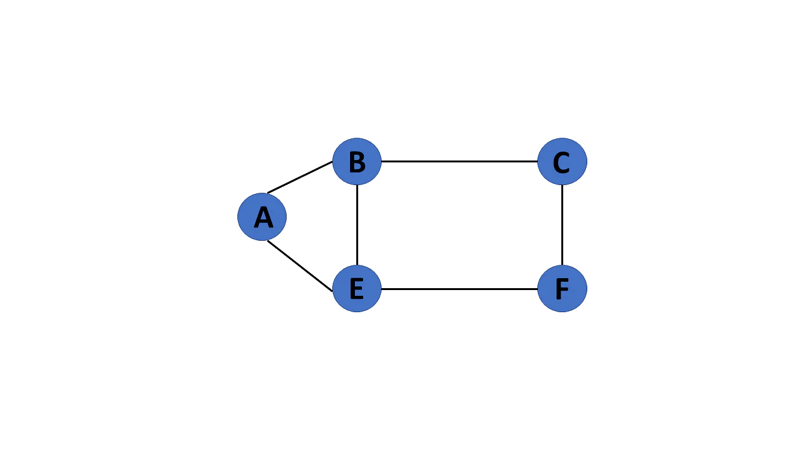  

### 7- Acyclic Graph  
- When there are no cycles in a graph, it is called an acyclic graph.  

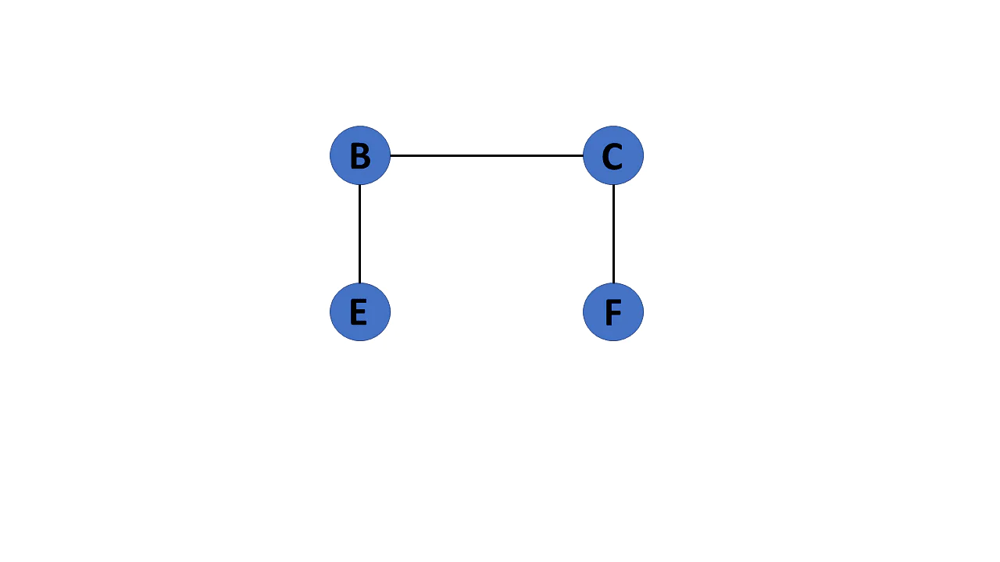

## Graph Representation  
- Graphs in data structures are used to represent the relationships between objects.  
### Adjacency Matrix  
- An adjacency matrix is a 2D array of V x V vertices. Each row and column represent a vertex.  
- If the value of any element a[i][j] is 1, it represents that there is an edge connecting vertex i and vertex j.  

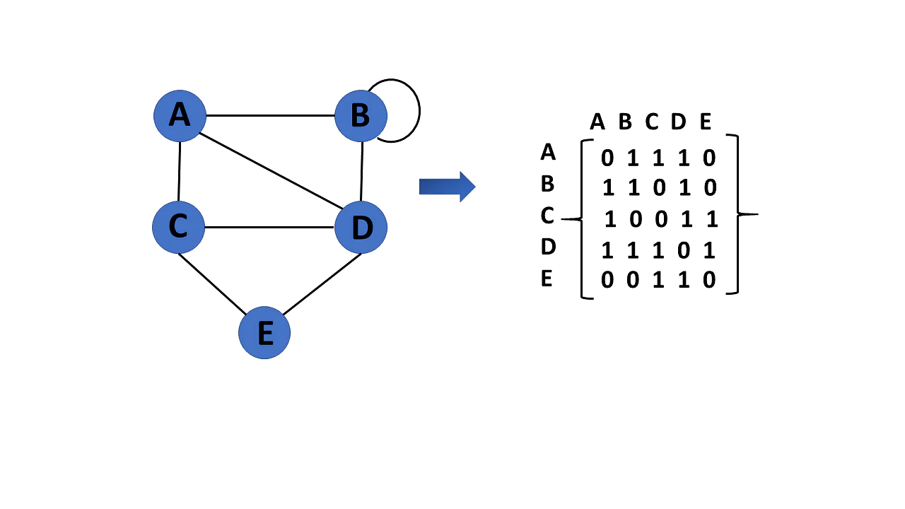  

### Adjacency List
- An adjacency list represents a graph as an array of linked lists.
- The index of the array represents a vertex and each element in its linked list represents the other vertices that form an edge with the vertex.  

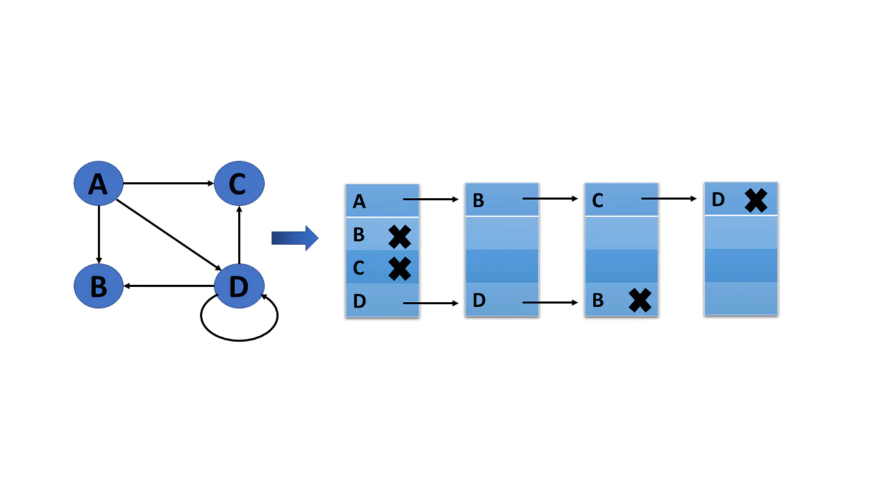   

## Weighted Graph  
- A graph G= (V, E) is called a labeled or weighted graph because each edge has a value or weight representing the cost of traversing that edge.  

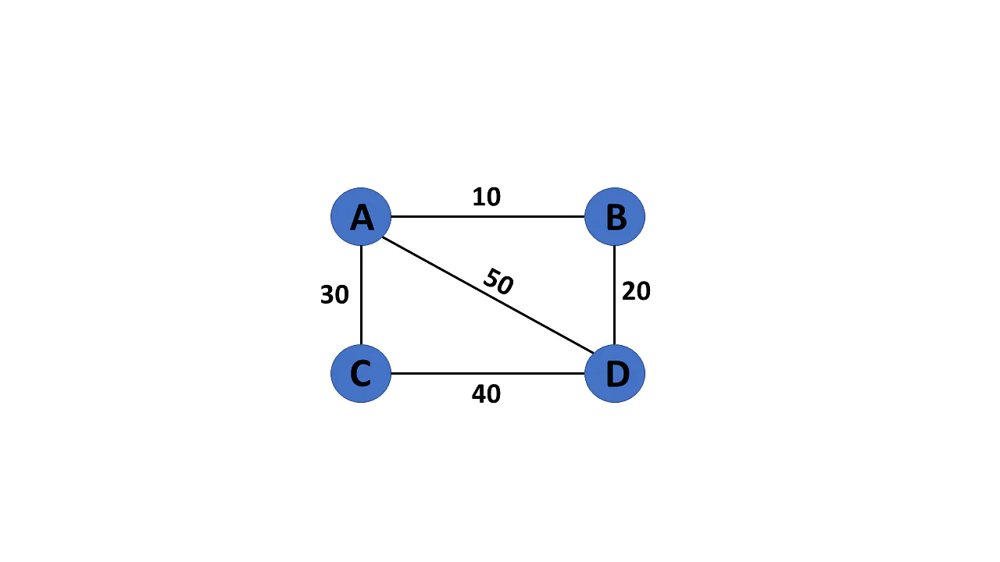  

## Graph Traversal Algorithms  
### 1- Breadth-first search
- BFS is a search technique for finding a node in a graph data structure that meets a set of criteria.  
- It begins at the root of the graph and investigates all nodes at the current depth level before moving on to nodes at the next depth level.  
- To maintain track of the child nodes that have been encountered but not yet inspected, more memory, generally you require a queue.  
- Algorithm of breadth-first search  
   - Consider the graph you want to navigate.
   - Select any vertex in your graph, say v1, from which you want to traverse the graph.   
   - Examine any two data structures for traversing the graph (Visited array (size of the graph),Queue data structure).  
   - Starting from the vertex, you will add to the visited array, and afterward, you will v1's adjacent vertices to the queue data structure.  
   - Now, using the FIFO concept, you must remove the element from the queue, put it into the visited array, and then return to the queue to add the adjacent vertices of the removed element.  
   - Repeat step 5 until the queue is not empty and no vertex is left to be visited.  

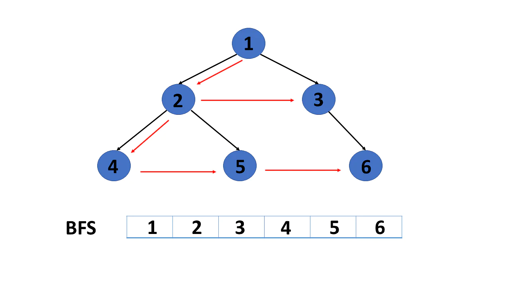

### 2- Depth-First Search or DFS  
- DFS is a search technique for finding a node in a graph data structure that meets a set of criteria.   
- The depth-first search (DFS) algorithm traverses or explores data structures such as trees and graphs. The DFS algorithm begins at the root node and examines each branch as far as feasible before backtracking.  
- To maintain track of the child nodes that have been encountered but not yet inspected, more memory, generally a stack, is required.  
- Algorithm of depth-first search:  
   - Consider the graph you want to navigate.  
   - Select any vertex in our graph, say v1, from which you want to begin traversing the graph.  
   - Examine any two data structures for traversing the graph (Visited array (size of the graph), Stack data structure).  
   - Insert v1 into the array's first block and push all the adjacent nodes or vertices of vertex v1 into the stack.  
   - Now, using the FIFO principle, pop the topmost element and put it into the visited array, pushing all of the popped element's nearby nodes into it.  
   - If the topmost element of the stack is already present in the array, discard it instead of inserting it into the visited array.  
   - Repeat step 6 until the stack data structure isn't empty.  

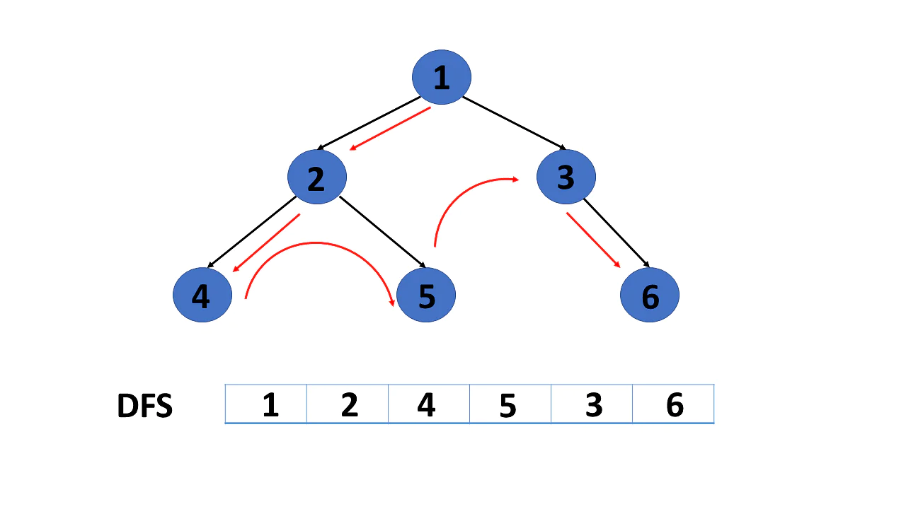

