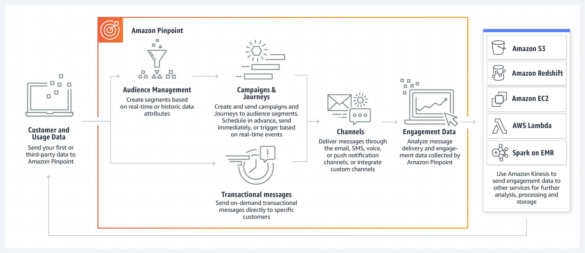

# Amazon Pinpoint
- Amazon Pinpoint is a flexible and scalable outbound and inbound marketing communications service.   
- You can connect with customers over channels like email, SMS, push, voice or in-app messaging.  
## Benefits  
- Get started quickly.
- Segment and personalize for impact
- Measure your efficiency
- Scale securely with the experts

## How it works

## Use cases  
- Marketing messages : Promote your products and services with basic templates or highly-personalized messages, including special offers, newsletters, and other engaging content.
- Transactional messages : Send immediate, trigger-based customer communications across channels directly from your application, such as purchase confirmations, one-time passwords, or shipping notifications. With SMS, you can receive messages back from your customers.
- Bulk communications : Send messages to communities of millions, including notifications and announcements.

# Amazon Polly
- Amazon Polly is a cloud service that converts text into lifelike speech. 
- You can use Amazon Polly to develop applications that increase engagement and accessibility.  
