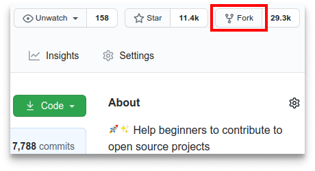
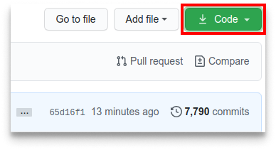

# Open-Source Software Contribution
- Open source refers to source code that is made available to the public to view, use, modify, and distribute under a license. It’s usually developed and maintained collaboratively by a community of its users.   
- Although the main point of  open source projects is to create valuable and accessible open source software, individual contributors can get plenty of personal benefit from contributing to them.   
- You help maintain the software you use while honing your technical skills.When you’re applying for jobs, you can point to your work on open source software as proof of your skills.   
- Contributing to open source can be intimidating and confusing depending on the project you’re working on.

## Make your first Contributions
### Fork the repository
- Fork the repository by clicking on the fork button on the top of the repo page. This will create a copy of this repository in your account.



### Clone the repository
- clone the forked repository to your machine. Go to your GitHub account, open the forked repository, click on the code button and then click the copy to clipboard icon.
- Open a terminal and run the following git command:

   ```
   git clone "url you just copied"
   ```


- "url you just copied" (without the quotation marks) is the url of the forked repository, For example:

   ```
   git clone https://github.com/this-is-you/first-contributions.git
   ```


### Create a branch
- create a branch using the **git checkout** command:

   ```
   git checkout -b your-new-branch-name
   ```
- For example: 
 
   ```
   git checkout -b add-alonzo-church
   ```
### Make necessary changes and commit those changes
- Add those changes to the branch you just created using the git add command:
   ```
   git add Contributors.md
   ```
- Now commit those changes using the git commit command:  
   ```
   git commit -m "Add <your-name> to Contributors list"
   ```
### Push changes to GitHub
- Push your changes using the command git push: 
   ```
   git push origin <add-your-branch-name>
   ```
- replacing <add-your-branch-name> with the name of the branch you created earlier.
  
### Submit your changes for review
- If you go to your repository on GitHub, you'll see a Compare & pull request button. Click on that button.
  

  
- Now submit the pull request.

  
## Resources
- [first Contributions](https://github.com/firstcontributions/first-contributions)
- [contributing to open source](https://stackoverflow.blog/2020/08/03/getting-started-with-contributing-to-open-source/)
  
