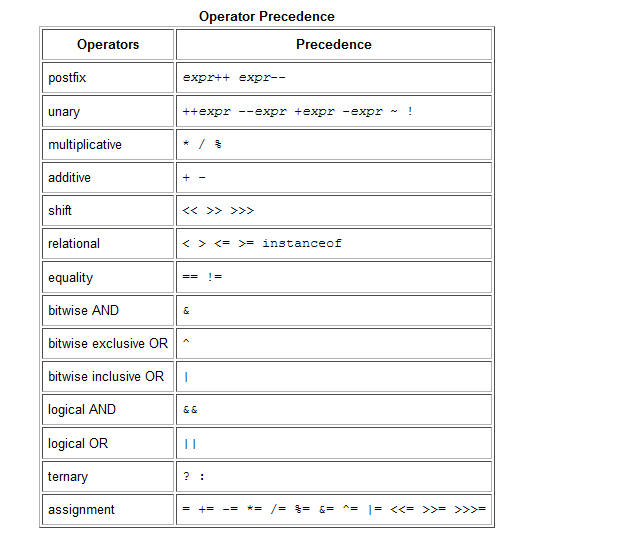

# java basics  

- #### There is four kinds of variables in java programming language:  
     1- **Instance Variables (Non-Static Fields)** : fields declared without the static keyword. Non-static fields are also known as instance variables because their values are unique to each instance of a class (to each object, in other words).  
    2- **Class Variables (Static Fields)** : any field declared with the static modifier; this tells the compiler that there is exactly one copy of this variable in existence, regardless of how many times the class has been instantiated.  
    3- **Local Variables** : The syntax for declaring a local variable is similar to declaring a field (for example, int count = 0;). There is no special keyword designating a variable as local; that determination comes entirely from the location in which the variable is declared — which is between the opening and closing braces of a method. As such, local variables are only visible to the methods in which they are declared; they are not accessible from the rest of the class.  
    4- **Parameters** : both in the Bicycle class and in the main method of the "Hello World!" application. Recall that the signature for the main method is public static void main(String[] args). Here, the args variable is the parameter to this method.  
- #### Naming  
     1- Variable names are case-sensitive.  
     2- If the name you choose consists of only one word, spell that word in all lowercase letters. If it consists of more than one word, capitalize the first letter of each subsequent word.  
- #### primitive data types:
     1- **byte**: The byte data type is an 8-bit signed two's complement integer, he byte data type can be useful for saving memory in large arrays, where the memory savings actually matters.     
     2- **short**: The short data type is a 16-bit signed two's complement integer, you can use a short to save memory in large arrays, in situations where the memory savings actually matters.  
     3- **int**: By default, the int data type is a 32-bit signed two's complement integer.  
     4- **long**: The long data type is a 64-bit two's complement integer.  
     5- **float**: The float data type is a single-precision 32-bit IEEE 754 floating point, use a float (instead of double) if you need to save memory in large arrays of floating point numbers.  
     6- **double**: The double data type is a double-precision 64-bit IEEE 754 floating point.  
     7- **boolean**: The boolean data type has only two possible values: true and false. Use this data type for simple flags that track true/false conditions. This data type represents one bit of information.  
     8- **char**: The char data type is a single 16-bit Unicode character.  
- It's not always necessary to assign a value when a field is declared. Fields that are declared but not initialized will be set to a reasonable default by the compiler, the default values for the above data types:   
       1- byte -> 	0  
       2- short -> 	0  
       3- int -> 	0  
       4- long ->	0L  
       5- float ->	0.0f  
       6- double ->	0.0d  
       7- char -> 	'\u0000'  
       8- String (or any object)  -> 	null  
       9- boolean  ->	false  
- #### Arrays  
   - An array is a container object that holds a fixed number of values of a single type. The length of an array is established when the array is created. After creation, its length is fixed.  
   - Each item in an array is called an element, and each element is accessed by its numerical index.
    ```
      class ArrayDemo {
    public static void main(String[] args) {
        // declares an array of integers
        int[] anArray;

        // allocates memory for 10 integers
        anArray = new int[10];
           
        // initialize first element
        anArray[0] = 100;
        // initialize second element
        anArray[1] = 200;
        // and so forth
        anArray[2] = 300;
        anArray[3] = 400;
        anArray[4] = 500;
        anArray[5] = 600;
        anArray[6] = 700;
        anArray[7] = 800;
        anArray[8] = 900;
        anArray[9] = 1000;

        System.out.println("Element at index 0: "
                           + anArray[0]);
        System.out.println("Element at index 1: "
                           + anArray[1]);
        System.out.println("Element at index 2: "
                           + anArray[2]);
        System.out.println("Element at index 3: "
                           + anArray[3]);
        System.out.println("Element at index 4: "
                           + anArray[4]);
        System.out.println("Element at index 5: "
                           + anArray[5]);
        System.out.println("Element at index 6: "
                           + anArray[6]);
        System.out.println("Element at index 7: "
                           + anArray[7]);
        System.out.println("Element at index 8: "
                           + anArray[8]);
        System.out.println("Element at index 9: "
                           + anArray[9]);
     }
   }
   
  ```   
  The output from this program is:
    ```
    Element at index 0: 100
    Element at index 1: 200
    Element at index 2: 300
    Element at index 3: 400
    Element at index 4: 500
    Element at index 5: 600
    Element at index 6: 700
    Element at index 7: 800
    Element at index 8: 900
    Element at index 9: 1000
    ```
 - #### Operators  
    -  Operators are special symbols that perform specific operations on one, two, or three operands, and then return a result.  
    
        
 - #### Blocks  
    - A block is a group of zero or more statements between balanced braces and can be used anywhere a single statement is allowed.  
      ```
      class BlockDemo {
      public static void main(String[] args) {
           boolean condition = true;
           if (condition) { // begin block 1
                 System.out.println("Condition is true.");
            } // end block one
            else { // begin block 2
                  System.out.println("Condition is false.");
            } // end block 2
        }
      }
      ```
 - #### expression  
    - An expression is a construct made up of variables, operators, and method invocations, which are constructed according to the syntax of the language, that evaluates to a single value.   
      ```
      int cadence = 0;
      anArray[0] = 100;
      System.out.println("Element 1 at index 0: " + anArray[0]);

      int result = 1 + 2; // result is now 3
      if (value1 == value2) 
      System.out.println("value1 == value2");
      ```
- #### Control flow statements  
- **Control flow statements**, however, break up the flow of execution by employing decision making, looping, and branching, enabling your program to conditionally execute particular blocks of code.  
- This section describes the decision-making statements **(if-then, if-then-else, switch)**, the looping statements **(for, while, do-while)**, and the branching statements **(break, continue, return)** supported by the Java programming language.  
- The **if-then Statement** : The if-then statement is the most basic of all the control flow statements. It tells your program to execute a certain section of code only if a particular test evaluates to true.  
    ```
    void applyBrakes() {
    // the "if" clause: bicycle must be moving
    if (isMoving){ 
        // the "then" clause: decrease current speed
        currentSpeed--;
     }
   }
   ```  
- The **if-then-else Statement** : The if-then-else statement provides a secondary path of execution when an "if" clause evaluates to false.  
    ```
    class IfElseDemo {
    public static void main(String[] args) {

        int testscore = 76;
        char grade;

        if (testscore >= 90) {
            grade = 'A';
        } else if (testscore >= 80) {
            grade = 'B';
        } else if (testscore >= 70) {
            grade = 'C';
        } else if (testscore >= 60) {
            grade = 'D';
        } else {
            grade = 'F';
        }
        System.out.println("Grade = " + grade);
    }
  }
  ```
- **The switch Statement** :  the switch statement can have a number of possible execution paths. A switch works with the byte, short, char, and int primitive data types.  
    ```
    public class SwitchDemo {
    public static void main(String[] args) {

        int month = 8;
        String monthString;
        switch (month) {
            case 1:  monthString = "January";
                     break;
            case 2:  monthString = "February";
                     break;
            case 3:  monthString = "March";
                     break;
            case 4:  monthString = "April";
                     break;
            case 5:  monthString = "May";
                     break;
            case 6:  monthString = "June";
                     break;
            case 7:  monthString = "July";
                     break;
            case 8:  monthString = "August";
                     break;
            case 9:  monthString = "September";
                     break;
            case 10: monthString = "October";
                     break;
            case 11: monthString = "November";
                     break;
            case 12: monthString = "December";
                     break;
            default: monthString = "Invalid month";
                     break;
        }
        System.out.println(monthString);
    }
  }
  ```
In this case, August is printed to standard output.  
- **The while and do-while Statements** : The while statement continually executes a block of statements while a particular condition is true.  
    ```
    class WhileDemo {
    public static void main(String[] args){
        int count = 1;
        while (count < 11) {
            System.out.println("Count is: " + count);
            count++;
        }
    }
  }
  ```
- **The while statement** : do-while evaluates its expression at the bottom of the loop instead of the top. Therefore, the statements within the do block are always executed at least once.  
    ```
    class DoWhileDemo {
    public static void main(String[] args){
        int count = 1;
        do {
            System.out.println("Count is: " + count);
            count++;
        } while (count < 11);
    }
  }
  ```
- **The for Statement** : The for statement provides a compact way to iterate over a range of values. Programmers often refer to it as the "for loop" because of the way in which it repeatedly loops until a particular condition is satisfied.
    ```
    class ForDemo {
    public static void main(String[] args){
         for(int i=1; i<11; i++){
              System.out.println("Count is: " + i);
         }
    }
  }
- **Infinite loop**
   ```
   // infinite loop
   for ( ; ; ) {
    
    // your code goes here
   }
   ```
- **The enhanced for statement** 
     ```
     class EnhancedForDemo {
    public static void main(String[] args){
         int[] numbers = 
             {1,2,3,4,5,6,7,8,9,10};
         for (int item : numbers) {
             System.out.println("Count is: " + item);
         }
    }
  }
  ```
- **The break Statement**  
    ```
    class BreakDemo {
    public static void main(String[] args) {

        int[] arrayOfInts = 
            { 32, 87, 3, 589,
              12, 1076, 2000,
              8, 622, 127 };
        int searchfor = 12;

        int i;
        boolean foundIt = false;

        for (i = 0; i < arrayOfInts.length; i++) {
            if (arrayOfInts[i] == searchfor) {
                foundIt = true;
                break;
            }
        }

        if (foundIt) {
            System.out.println("Found " + searchfor + " at index " + i);
        } else {
            System.out.println(searchfor + " not in the array");
        }
    }
  }
  ```
- **The continue Statement** : The continue statement skips the current iteration of a for, while , or do-while loop.  
    ```
    class ContinueWithLabelDemo {
    public static void main(String[] args) {

        String searchMe = "Look for a substring in me";
        String substring = "sub";
        boolean foundIt = false;

        int max = searchMe.length() - 
                  substring.length();

    test:
        for (int i = 0; i <= max; i++) {
            int n = substring.length();
            int j = i;
            int k = 0;
            while (n-- != 0) {
                if (searchMe.charAt(j++) != substring.charAt(k++)) {
                    continue test;
                }
            }
            foundIt = true;
                break test;
        }
        System.out.println(foundIt ? "Found it" : "Didn't find it");
    }
  }
  ```
- **The return Statement** : The return statement exits from the current method.  
  ```
  return ++count;
  ```
  or
  ```
  return;
  ```

